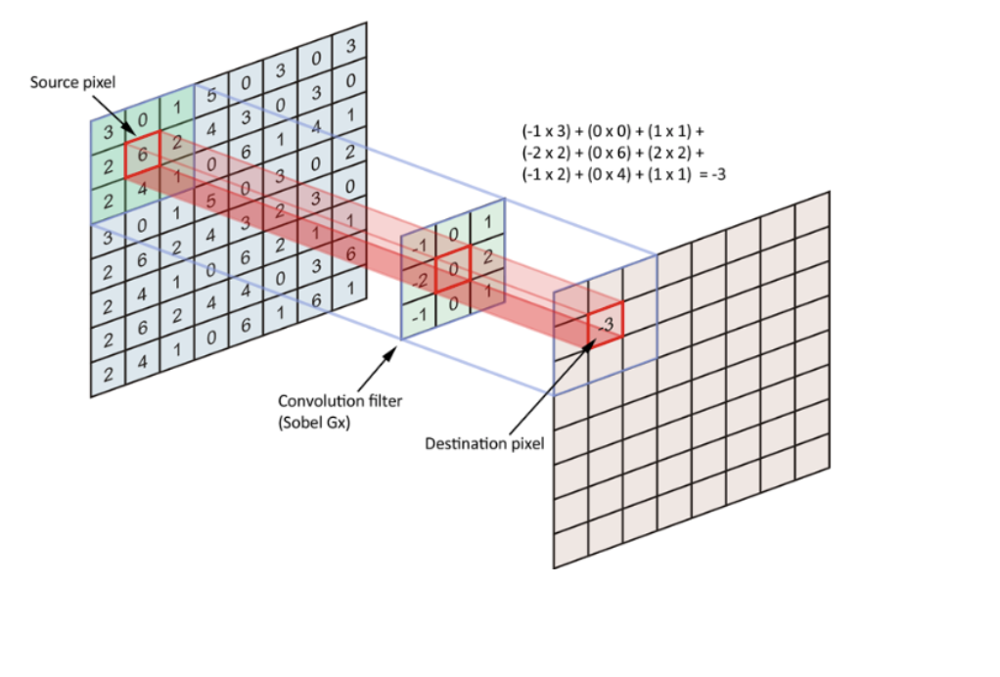
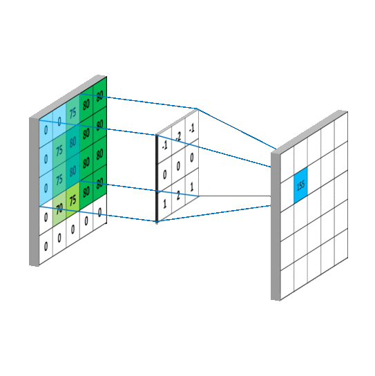
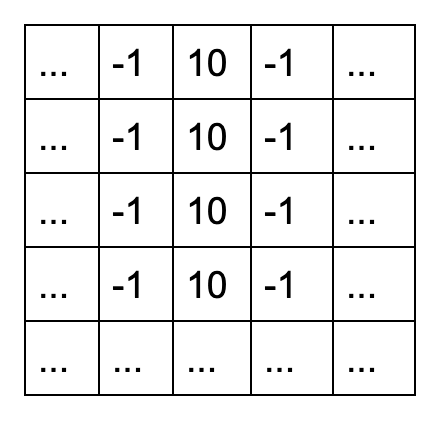
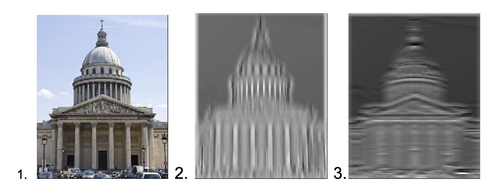
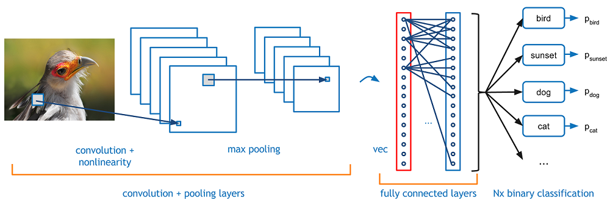

# Sujet day-4

Lors de l'entraînement d'un de vos réseau de neurons, plusieurs paramètres sont très importants.

Tout d'abord le choix du nombre de neurones et de couches.
 
Ce paramètre est très difficile à trouver sachant qu'il
n'y a pas de recette miracle afin de le connaître.
 
Afin qu'il soit le plus optimal possible ou du moins sans rapprocher, il faut tester
et voir à quel moment votre réseaux est le plus fiable (meilleur taux de réussite) possible.

Le nombre d'Epochs est également très important à prendre en compte car si vous entraîner
trop votre réseau, vous pouvez faire de [l'overfitting](https://fr.wikipedia.org/wiki/Surapprentissage)
ce qui empechera de trouver des cas inconus (cas non entraînés) pour un réseaux
qui a pour rôle de classfier.

Le learning rate quand à lui peut être trouver grâce à votre fonction loss.
 
Si votre loss descend d'un coup mais stagne vite c'est que le learning rate
peut être trop élevé par exemple.

Avant de continuer, renseigner vous sur un paramètre que vous ne connaisser pas, les Batch.
Lors d'un entraînement sur plusieurs milliers de données, le mieux n'est pas de tout donner à votre réseau.
Une solution possible est de choisit à chaque fois 100 données choisies aléatoirement par exemple.

Depuis plusieurs jours vous travailler sur des réseaux de neurones completement
connétés (fully-connected)

Aujourd'hui vous aller aborder les réseaux de neurones convolutionnel (CNN)
  
Les CNN ont une ou plusieurs couches dans leur réseaux qui serviront à appliquer une convolution
 
Le but de la convolution est de faire ressortir les données qui peuvent nous intéresse le plus.
 
Pour cela nous allons passer un “filtre” qui va nous
permettre de changer les valeurs de nos données.

Le filtre est de la dimension que nous souhaitons,
par exemple pour une image qui est donc un tableau de pixel (2d),
nous allons faire un filtre 2d.
 

 

 
Si nous voulons faire ressortir les formes verticales d’une image, le filtre que nous utiliserons peut être d’une dimension 15x15. Nous allons remplir le filtre avec des valeurs égales à -1 sauf la colonne du milieu, les valeurs seront de 10.

 
Pour faire ressortir les formes horizontales d’une image, le filtre sera le même sauf qu’au lieu d’avoir des valeurs égales à 10 sur la colonne du milieu, elles seront sur la ligne du milieu.

 
Voici un exemple de ce que l’on peut faire avec de la convolution,
l’image 1 est l’original, on a fait passer un filtre Verticale sur
la 2eme et peut voir que les colonnes ressortent.
 
Avec un filtre
horizontale sur la 3ème et on peut voir que les barres du milieu
du panthéon sont ressorties.

Voici un shéma vous permettant de comprendre le fonctionnement complet d'un CNN.

Voici un lien vers un
[cours complet](https://towardsdatascience.com/a-comprehensive-guide-to-convolutional-neural-networks-the-eli5-way-3bd2b1164a53)
pour plus d'informations.

# Exercice

- Créer un CNN capable de classifier les données du dataset [Fashion-MNIST](https://pytorch.org/docs/stable/torchvision/datasets.html#fashion-mnist)
- Même exercice sur les données du dataset [Cifar-100](https://www.programcreek.com/python/example/105099/torchvision.datasets.CIFAR100)

 
 
Jusqu'à présent, tout les datasets sur lesquel vous deviez travailler étaient simple et parfait.
 
Les datasets sont la base pour la réussite d'un entraînement.
 
En général vous devez souvent normaliser vos données afin de simplifier le travail de votre réseau.
 
Il est également important d'afficher graphiquement vos données afin de choisir lesquel choisir.
 
Une donnée qui ne change jamais n'est pas forcément intérressante notament.

# Exercice

Depuis le dataset suivant, [Card-Fraud](https://www.kaggle.com/mlg-ulb/creditcardfraud#creditcard.csv)

- Afficher vos données grâce à [matplotlib](https://matplotlib.org/)
- Determiner quel données sont utiles à garder
- Créer un réseau de neurones afin d'avoir le plus haut taux de réussite possible sur la détection de fraude.
